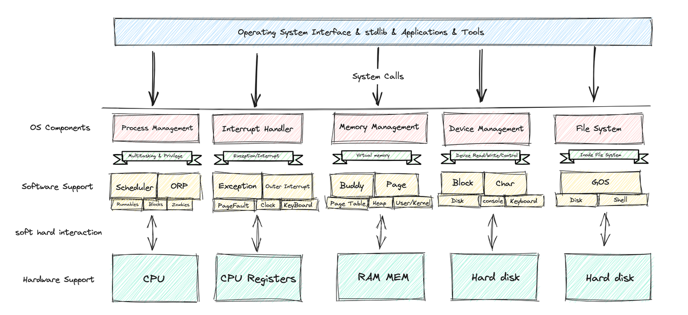

# GOS 操作系统开发
## 介绍
    实现了一个操作系统内核项目GOS，其实现了：内存管理（堆管理、页式虚拟存储系统）、进程管理、中断/异常/系统调用、磁盘IO、文件系统、shell终端。
1. 内存管理：实现了伙伴系统Buddy；页式虚拟存储系统，二级页表。
2. 进程管理：实现了进程调度与管理；用户级进程；
3. 中断：外中断，实现了时钟中断和键盘中断；
4. 异常：实现了缺页异常、除零异常、保护异常等20个异常处理。
5. 系统调用：实现了SYSCALL_GET_TIME，SYSCALL_READ，SYSCALL_WRITE，SYSCALL_GET_PID，SYSCALL_GET_PPID，SYSCALL_YIELD，SYSCALL_EXIT，SYSCALL_WAIT_PID，SYSCALL_TASK_INFO，SYSCALL_MMAP，SYSCALL_MUNMAP，SYSCALL_SLEEP等诸多系统调用
6. 磁盘IO：实现了PIO（可编程输入输出） 读写磁盘；设备管理器的实现；
7. 文件系统：实现了一个Inode文件系统，采用27个直接索引、1个一级索引、1个二级索引。并提供了PrintfWorkingDirectory、ChangeDirectory、ListFiles、MakeDirectory、CreateFile、ClearFileContent、ReadFileLine、WriteFileContent、PrintFileContent、RemoveFile、GetFileDescriptorByFileName等诸多文件操作。
8. shell终端：实现一个shell终端（自己起名），内置了cat、ls、cd、mkdir、pwd、echo、vim、touch、rm、ps等常用的类Linux命令。
9. 实现了操作系统级别的C语言泛型数据结构：锁、循环队列、哈希表等

## GOS架构图

## 代码分布与链接
**★★★★★总目录链接：[开发目录文档索引](https://m13n4gzucg.feishu.cn/docx/Fth3d2wnAoOiNIxilF3cxOnpnwg)**
| 分支         | 分支内容                                     | 对应文档链接                                                                                               |
| ------------ | -------------------------------------------- | ---------------------------------------------------------------------------------------------------------- |
| master       | 操作系统最终版本                             | 该README                                                                                                   |
| feature/ch0  | Bootloader，进入内核                         |                                                                                                            |
| feature/ch1  | 控制台输出                                   |                                                                                                            |
| feature/ch2  | 输出扩展+内存初步管理                        |                                                                                                            |
| feature/ch3  | 中断异常与系统调用                           |                                                                                                            |
| feature/ch4  | 进程管理与调度                               |                                                                                                            |
| feature/ch5  | 用户态与内核态                               |                                                                                                            |
| feature/ch6  | 页式虚拟存储系统-二级页表                    |                                                                                                            |
| feature/ch7  | Fork概念与设计-进程树                        |                                                                                                            |
| feature/ch8  | 系统调用实现-合集                            |                                                                                                            |
| feature/ch9  | 磁盘识别与读写                               |                                                                                                            |
| feature/ch10 | GFS（非GoogleFS）文件系统-Inode              |                                                                                                            |
| feature/ch11 | GShell命令行终端                             |                                                                                                            |
| feature/lab0 | 完成中间代码的磁盘加载和执行                 | [Location](https://m13n4gzucg.feishu.cn/docx/EMypdsUgSo63qoxcbN2cXXi2nrc#part-Pn6Odp6R0oGDMlxg6U9cJqj2nzb) |
| feature/lab1 | log日志实现与固定分区分配                    | [Location](https://m13n4gzucg.feishu.cn/docx/ARyod2E3oortWqxzDVgcDisyndg#part-GQCIdkCMTogsdxxahMic458wnNe) |
| feature/lab2 | 中断与系统调用                               | [Location](https://m13n4gzucg.feishu.cn/docx/JpE1dhEDdod47wxpl55cqiUAnBb#part-VPSkd7m0DohpEZxDJ17cusubnng) |
| feature/lab3 | FCFS进程调度BUG修复与调度实现                | [Location](https://m13n4gzucg.feishu.cn/docx/HTwvdVZqHoYKsnx2uRQcnhiTnbc#part-D5VddklOEoGFnjxT4pWcQEppnwb) |
| feature/lab4 | 系统调用printf实现                           | [Location](https://m13n4gzucg.feishu.cn/docx/HPjrdsR2xooOTRxFsTlc40EBn7y#part-GcGldd4W2owgaTxJ7YxcsXNtngb) |
| feature/lab5 | 缺页异常实现                                 | [Location](https://m13n4gzucg.feishu.cn/docx/FrovdSQMOoYlZpxfUT9c5ai3nSd#part-WlRZd88uQoUYnoxbk6icn4Fvnqh) |
| feature/lab6 | 系统调用实现                                 | [Location](https://m13n4gzucg.feishu.cn/docx/BAA8dXv3VoH27qxNIFcceS4Xnec#part-EW3Hd4W3UoZTWnxBef0cufvMnBe) |
| feature/lab7 | 磁盘读写缓存实现                             | [Location](https://m13n4gzucg.feishu.cn/docx/X6vnd6T0Los4lHxgg1fcvYVknKh#part-Sbfxd9g86oaM2tx8JXtctrTensd) |
| feature/lab8 | 实现经典Shell命令                            | [Location](https://m13n4gzucg.feishu.cn/docx/HdYddzbfuoetJwxzeVlcWkLmnWh#part-AXNQdBSOOoDbLWx7Go3cPCQanJd) |
| feature/lab9 | 进程调度算法、页面置换算法、磁盘调度算法实现 | [Location](https://m13n4gzucg.feishu.cn/docx/HdYddzbfuoetJwxzeVlcWkLmnWh#part-PuySdhnRXo5YzGxf2otcNewBn8b) |

## 未来计划
 1.  使开发文档更加完善易懂。
 2.  实现虚拟文件系统。
 3.  优化操作系统性能：磁盘读写--DMA方式；引入线程等。
 4.  增加操作系统安全性：增加用户权限校验等。
 5.  实现更为丰富的Shell命令行工具。如：vim、top、tree等。
 6.  实现网络设备接口，网络功能。
 7.  实现Desktop。